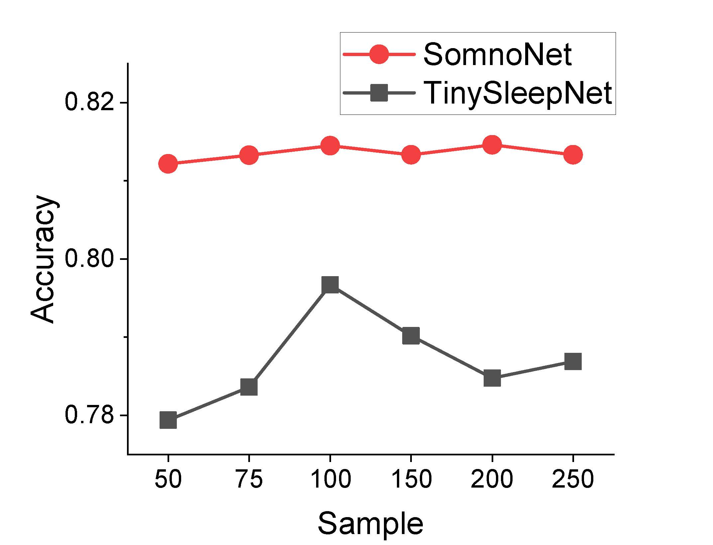

# SomnoNet
## A simple, efficient, and interpretable sleep staging method (SOTA)

<table><thead>
  <tr>
    <th colspan="2" rowspan="2">Dataset</th>
    <th colspan="3">Overall</th>
    <th colspan="5">F1 score</th>
  </tr>
  <tr>
    <th>OA</th>
    <th>MF1</th>
    <th>k</th>
    <th>W</th>
    <th>N1</th>
    <th>N2</th>
    <th>N3</th>
    <th>R</th>
  </tr></thead>
<tbody>
  <tr>
    <td rowspan="6">Physio2018</td>
    <td>SomnoNet</td>
    <td><b>80.9</b></td>
    <td><b>79.0</b></td>
    <td><b>0.739</b></td>
    <td><b>84.6</b></td>
    <td><ins>59.0</ins></td>
    <td><ins>85.1</ins></td>
    <td><b>80.2</b></td>
    <td><b>86.3</b></td>
  </tr>
  <tr>
    <td>SleePyCo</td>
    <td><b>80.9</b></td>
    <td><ins>78.9</ins></td>
    <td><ins>0.737</ins></td>
    <td><ins>84.2</ins></td>
    <td><b>59.3</b></td>
    <td><b>85.3</b></td>
    <td><ins>79.4</ins></td>
    <td><b>86.3</b></td>
  </tr>
  <tr>
    <td>SomnoNet-nano</td>
    <td>80.5</td>
    <td>78.6</td>
    <td>0.734</td>
    <td>84.0</td>
    <td>57.8</td>
    <td>84.8</td>
    <td><b>80.2</b></td>
    <td><ins>86.2</ins></td>
  </tr>
  <tr>
    <td>XSleepNet</td>
    <td>80.3</td>
    <td>78.6</td>
    <td>0.732</td>
    <td>-</td>
    <td>-</td>
    <td>-</td>
    <td>-</td>
    <td>-</td>
  </tr>
  <tr>
    <td>SeqSleepNet</td>
    <td>79.4</td>
    <td>77.6</td>
    <td>0.719</td>
    <td>-</td>
    <td>-</td>
    <td>-</td>
    <td>-</td>
    <td>-</td>
  </tr>
  <tr>
    <td>U-time</td>
    <td>78.8</td>
    <td>77.4</td>
    <td>0.714</td>
    <td>82.5</td>
    <td>59.0</td>
    <td>83.1</td>
    <td>79.0</td>
    <td>83.5</td>
  </tr>
  <tr>
    <td rowspan="7">SHHS</td>
    <td>SomnoNet</td>
    <td><b>88.1</b></td>
    <td><b>80.8</b></td>
    <td><b>0.833</b></td>
    <td><b>93.1</b></td>
    <td>48.6</td>
    <td><b>88.6</b></td>
    <td><ins>85.0</ins></td>
    <td><b>88.6</b></td>
  </tr>
  <tr>
    <td>SleePyCo</td>
    <td><ins>87.9</ins></td>
    <td><ins>80.7</ins></td>
    <td><ins>0.830</ins></td>
    <td><ins>92.6</ins></td>
    <td><ins>49.2</ins></td>
    <td><ins>88.5</ins></td>
    <td>84.5</td>
    <td><b>88.6</b></td>
  </tr>
  <tr>
    <td>SleepTransformer</td>
    <td>87.7</td>
    <td>80.1</td>
    <td>0.828</td>
    <td>92.2</td>
    <td>46.1</td>
    <td>88.3</td>
    <td><b>85.2</b></td>
    <td><b>88.6</b></td>
  </tr>
  <tr>
    <td>XSleepNet</td>
    <td>87.6</td>
    <td><ins>80.7</ins></td>
    <td>0.826</td>
    <td>92.0</td>
    <td><b>49.9</b></td>
    <td>88.3</td>
    <td>85.0</td>
    <td><ins>88.2</ins></td>
  </tr>
    <tr>
    <td>SomnoNet-nano</td>
    <td>87.4</td>
    <td>79.0</td>
    <td>0.822</td>
    <td>92.3</td>
    <td>43.0</td>
    <td>88.0</td>
    <td>83.9</td>
    <td>87.9</td>
  </tr>
  <tr>
    <td>IITNet</td>
    <td>86.7</td>
    <td>79.8</td>
    <td>0.812</td>
    <td>90.1</td>
    <td>48.1</td>
    <td>88.4</td>
    <td><b>85.2</b></td>
    <td>87.2</td>
  </tr>
  <tr>
    <td>SeqSleepNet</td>
    <td>86.5</td>
    <td>78.5</td>
    <td>0.81</td>
    <td>-</td>
    <td>-</td>
    <td>-</td>
    <td>-</td>
    <td>-</td>
  </tr>
</tbody></table>

**Table1. Benchmarking against recent state-of-the-art methods**

**Fig1. EEG data with different adoption rates**

<table>
<thead>
  <tr>
    <th>Method</th>
    <th>parameter</th>
  </tr>
</thead>
<tbody>
  <tr>
    <td>SomnoNet-nano</td>
    <td><b>0.049M</b></td>
  </tr>
  <tr>
    <td>SomnoNet</td>
    <td><ins>0.43M</ins></td>
  </tr>
  <tr>
    <td>SalientSleepNet</td>
    <td>0.9M</td>
  </tr>
  <tr>
    <td>U-time</td>
    <td>1.1M</td>
  </tr>
  <tr>
    <td>TinySleepNet</td>
    <td>1.3M</td>
  </tr>
  <tr>
    <td>SleepEEGNet</td>
    <td>2.1M</td>
  </tr>
  <tr>
    <tr>SomnoNet</tr>
    <tr>21M</tr>
  </tr>      
</tbody>
</table>

**Table2. The number of model parameters for different methods**

