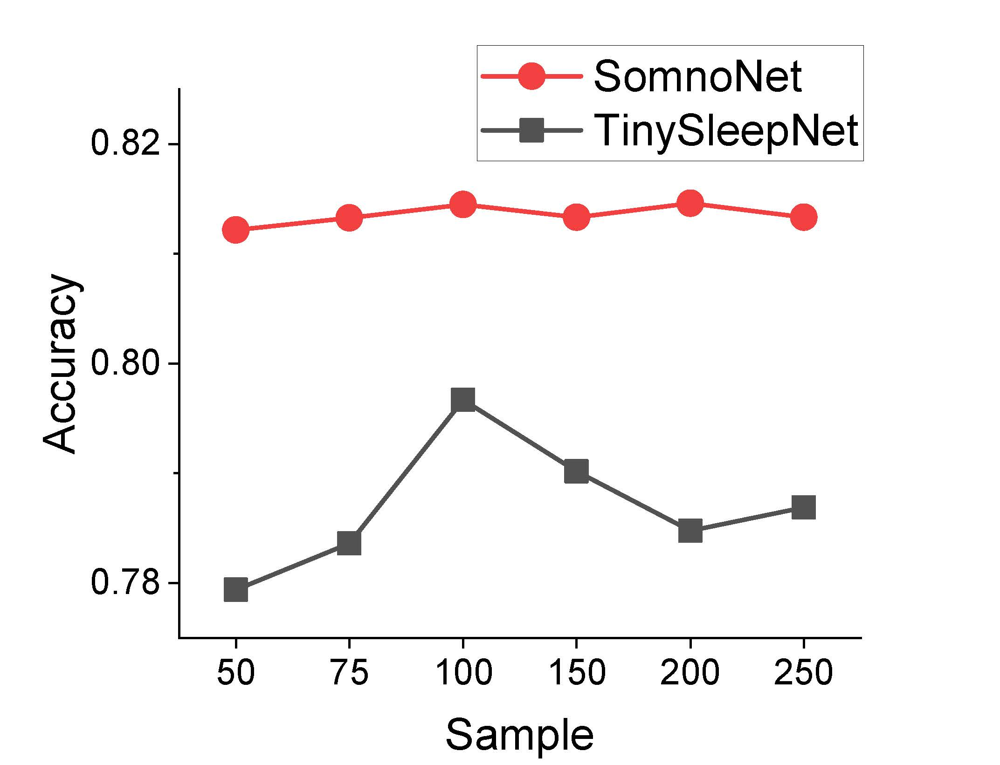

# SomnoNet
### A Lightweight and Interpretable Framework for Sleep Staging Using Single-Channel EEG
[](https://doi.org/10.1109/JBHI.2026.3713336)
[](https://doi.org/10.1109/JBHI.2026.3713336)
[](LICENSE)

**Accepted for publication in the IEEE Journal of Biomedical and Health Informatics (J-BHI), 2026.**

**Paper:** [SomnoNet: A Lightweight and Interpretable Framework for Sleep Staging Using Single-Channel EEG](https://doi.org/10.1109/JBHI.2026.3713336)  
**Authors:** Shengwei Guo and Guobing Sun  
**DOI:** [10.1109/JBHI.2026.3713336](https://doi.org/10.1109/JBHI.2026.3713336)

SomnoNet is a lightweight and interpretable deep learning framework for automatic sleep staging from raw single-channel EEG. It hierarchically models local EEG rhythms, intra-epoch organization, and inter-epoch temporal context while maintaining a compact parameter footprint.

SomnoNet-Nano further reduces the model size to only **0.049 million parameters** by reusing the learned morphology encoder and employing a lightweight temporal modeling module.

## Highlights

- End-to-end sleep staging from raw single-channel EEG.
- Hierarchical modeling of local rhythms, intra-epoch structure, and inter-epoch context.
- Competitive performance on the Physio2018 and SHHS benchmarks.
- Only **0.43M parameters** for SomnoNet.
- Only **0.049M parameters** for SomnoNet-Nano.
- Rhythm-aware interpretation of segment-level and epoch-level model evidence.
- Visualization notebooks, example data, and pretrained models are provided.
  
---

## 📊 Benchmark Results

<table><thead>
  <tr>
    <th colspan="2" rowspan="2">Dataset</th>
    <th colspan="3">Overall</th>
    <th colspan="5">F1 score</th>
  </tr>
  <tr>
    <th>OA</th>
    <th>MF1</th>
    <th>k</th>
    <th>W</th>
    <th>N1</th>
    <th>N2</th>
    <th>N3</th>
    <th>R</th>
  </tr></thead>
<tbody>
  <tr>
    <td rowspan="6">Physio2018</td>
    <td>SomnoNet</td>
    <td><b>80.9</b></td>
    <td><b>79.0</b></td>
    <td><b>0.739</b></td>
    <td><b>84.6</b></td>
    <td><ins>59.0</ins></td>
    <td><ins>85.1</ins></td>
    <td><b>80.2</b></td>
    <td><b>86.3</b></td>
  </tr>
  <tr>
    <td>SleePyCo</td>
    <td><b>80.9</b></td>
    <td><ins>78.9</ins></td>
    <td><ins>0.737</ins></td>
    <td><ins>84.2</ins></td>
    <td><b>59.3</b></td>
    <td><b>85.3</b></td>
    <td><ins>79.4</ins></td>
    <td><b>86.3</b></td>
  </tr>
  <tr>
    <td>SomnoNet-nano</td>
    <td>80.5</td>
    <td>78.6</td>
    <td>0.734</td>
    <td>84.0</td>
    <td>57.8</td>
    <td>84.8</td>
    <td><b>80.2</b></td>
    <td><ins>86.2</ins></td>
  </tr>
  <tr>
    <td>XSleepNet</td>
    <td>80.3</td>
    <td>78.6</td>
    <td>0.732</td>
    <td>-</td>
    <td>-</td>
    <td>-</td>
    <td>-</td>
    <td>-</td>
  </tr>
  <tr>
    <td>SeqSleepNet</td>
    <td>79.4</td>
    <td>77.6</td>
    <td>0.719</td>
    <td>-</td>
    <td>-</td>
    <td>-</td>
    <td>-</td>
    <td>-</td>
  </tr>
  <tr>
    <td>U-time</td>
    <td>78.8</td>
    <td>77.4</td>
    <td>0.714</td>
    <td>82.5</td>
    <td>59.0</td>
    <td>83.1</td>
    <td>79.0</td>
    <td>83.5</td>
  </tr>
  <tr>
    <td rowspan="7">SHHS</td>
    <td>SomnoNet</td>
    <td><b>88.1</b></td>
    <td><b>80.8</b></td>
    <td><b>0.833</b></td>
    <td><b>93.1</b></td>
    <td>48.6</td>
    <td><b>88.6</b></td>
    <td><ins>85.0</ins></td>
    <td><b>88.6</b></td>
  </tr>
  <tr>
    <td>SleePyCo</td>
    <td><ins>87.9</ins></td>
    <td><ins>80.7</ins></td>
    <td><ins>0.830</ins></td>
    <td><ins>92.6</ins></td>
    <td><ins>49.2</ins></td>
    <td><ins>88.5</ins></td>
    <td>84.5</td>
    <td><b>88.6</b></td>
  </tr>
  <tr>
    <td>SleepTransformer</td>
    <td>87.7</td>
    <td>80.1</td>
    <td>0.828</td>
    <td>92.2</td>
    <td>46.1</td>
    <td>88.3</td>
    <td><b>85.2</b></td>
    <td><b>88.6</b></td>
  </tr>
  <tr>
    <td>XSleepNet</td>
    <td>87.6</td>
    <td><ins>80.7</ins></td>
    <td>0.826</td>
    <td>92.0</td>
    <td><b>49.9</b></td>
    <td>88.3</td>
    <td>85.0</td>
    <td><ins>88.2</ins></td>
  </tr>
    <tr>
    <td>SomnoNet-nano</td>
    <td>87.4</td>
    <td>79.0</td>
    <td>0.822</td>
    <td>92.3</td>
    <td>43.0</td>
    <td>88.0</td>
    <td>83.9</td>
    <td>87.9</td>
  </tr>
  <tr>
    <td>IITNet</td>
    <td>86.7</td>
    <td>79.8</td>
    <td>0.812</td>
    <td>90.1</td>
    <td>48.1</td>
    <td>88.4</td>
    <td><b>85.2</b></td>
    <td>87.2</td>
  </tr>
  <tr>
    <td>SeqSleepNet</td>
    <td>86.5</td>
    <td>78.5</td>
    <td>0.81</td>
    <td>-</td>
    <td>-</td>
    <td>-</td>
    <td>-</td>
    <td>-</td>
  </tr>
</tbody></table>

**Table 1.** Comparison with representative sleep-staging methods.

OA and class-wise F1 scores are reported as percentages. MF1 denotes
macro-averaged F1 score, and $\kappa$ denotes Cohen's kappa. Bold and
underlined values indicate the best and second-best results, respectively.

<p align="center">
  
</p>

<p align="center">
  <b>Figure 1.</b> Performance of SomnoNet under different EEG sampling rates.
</p>


---
## Model Size Comparison

**Fig1. EEG data with different sampling rates**

<table>
<thead>
  <tr>
    <th>Method</th>
    <th>Parameters</th>
  </tr>
</thead>
<tbody>
  <tr>
    <td>SomnoNet-nano</td>
    <td><b>0.049M</b></td>
  </tr>
  <tr>
    <td>SomnoNet</td>
    <td><ins>0.43M</ins></td>
  </tr>
  <tr>
    <td>SalientSleepNet</td>
    <td>0.9M</td>
  </tr>
  <tr>
    <td>U-time</td>
    <td>1.1M</td>
  </tr>
  <tr>
    <td>TinySleepNet</td>
    <td>1.3M</td>
  </tr>
  <tr>
    <td>SleepEEGNet</td>
    <td>2.1M</td>
  </tr>
  <tr>
    <td>DeepSleepNet</td>
    <td>21M</td>
  </tr>      
</tbody>
</table>


**Table 2.** Parameter comparison with representative lightweight sleep-staging models.

---

## Interpretability and Visualization

SomnoNet provides rhythm-aware interpretation tools for examining how
local EEG segments and temporal context contribute to sleep-stage
predictions.

The repository includes three visualization notebooks:

- [`Interpretability_voting.ipynb`](Interpretability_voting.ipynb)  
  Visualizes segment-level evidence produced by the voting-based inference head.

- [`Interpretability_vector_forward.ipynb`](Interpretability_vector_forward.ipynb)  
  Analyzes the forward temporal contribution of learned EEG representations.

- [`Interpretability_vector_backward.ipynb`](Interpretability_vector_backward.ipynb)  
  Analyzes the backward temporal contribution of learned EEG representations.

Example EEG data and the corresponding pretrained models are provided in
[`example_data`](example_data) and [`weights`](weights), respectively.

## Citation

If you find SomnoNet useful in your research, please cite:

```bibtex
@article{guo2026somnonet,
  author  = {Shengwei Guo and Guobing Sun},
  title   = {SomnoNet: A Lightweight and Interpretable Framework for Sleep Staging Using Single-Channel EEG},
  journal = {IEEE Journal of Biomedical and Health Informatics},
  year    = {2026},
  doi     = {10.1109/JBHI.2026.3713336}
}
```

## License

This project is released under the [MIT License](LICENSE).

## Contact

For questions regarding the paper or implementation, please open a GitHub
issue or contact the authors through the correspondence information provided
in the paper(2211849@s.hlju.edu.cn).
